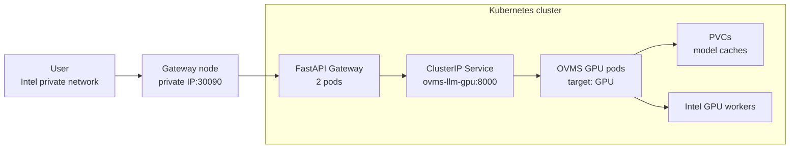

# Kubernetes OpenVINO LLM Inference Platform

This project deploys an OpenVINO Model Server LLM endpoint on Kubernetes and adds a small API gateway in front of it. The final target is an Intel private-network, bare-metal, GPU-only inference platform.

- Kubernetes schedules the inference server onto Intel GPU worker nodes.
- OpenVINO Model Server serves an optimized open-source LLM.
- A PersistentVolumeClaim caches model files across pod restarts.
- A FastAPI gateway hides the raw OVMS endpoint and adds a stable user-facing API.
- Smoke and stability tests validate the gateway and GPU inference route.

## Architecture



## Project Versions

| Version | Purpose | Status |
| --- | --- | --- |
| v1 | FastAPI gateway + OVMS service pattern | Implemented |
| v2 | Registry + private NodePort exposure | Implemented |
| v3 | Intel bare-metal GPU-only inference | Final target |

## AWS EKS Production-Shaped POC

The AWS implementation runbook is in [docs/aws-eks-openvino-llm-poc.md](docs/aws-eks-openvino-llm-poc.md). It covers an EKS deployment with Intel M7i CPU inference nodes, OpenVINO Model Server, the FastAPI gateway behind an internal ALB, Secrets Manager CSI, S3 model storage with EBS-backed pod caches, Argo CD GitOps, HPA, and blue-green promotion.

## Apply Order

Run these from the Intel private-network Kubernetes control-plane/admin machine:

Create the gateway API key secret first:

```powershell
.\scripts\create-gateway-secret.ps1 -ApiKey "<GATEWAY_API_KEY>"
```

Render the gateway manifest with your internal-registry image:

```powershell
.\scripts\render-gateway-image.ps1 -Image "registry.internal.intel.com/YOUR_TEAM/llm-gateway:0.1.0"
```

```bash
sudo kubectl apply -f k8s/gateway-secret.yaml
sudo kubectl apply -f k8s/ovms-llm-gpu-baremetal.yaml
sudo kubectl apply -f k8s/gateway-baremetal-rendered.yaml
sudo kubectl apply -f k8s/hpa-baremetal.yaml
```

Check health:

```bash
sudo kubectl get pods -o wide
sudo kubectl get svc
sudo kubectl get endpoints ovms-llm-gpu-service
```

Gateway smoke test:

```bash
curl -X POST http://<GATEWAY_NODE_PRIVATE_IP>:30090/chat \
  -H "Content-Type: application/json" \
  -H "X-API-Key: <GATEWAY_API_KEY>" \
  -d '{"message":"Say hello in one short sentence.","max_tokens":16}'
```

## Strict Demo Framing

This final version is intentionally GPU-only for inference:

- no CPU fallback model service
- no NPU canary path
- gateway is the only exposed service
- OVMS runs on Intel GPU workers only
- no LoadBalancer, MetalLB, or Ingress for this POC
