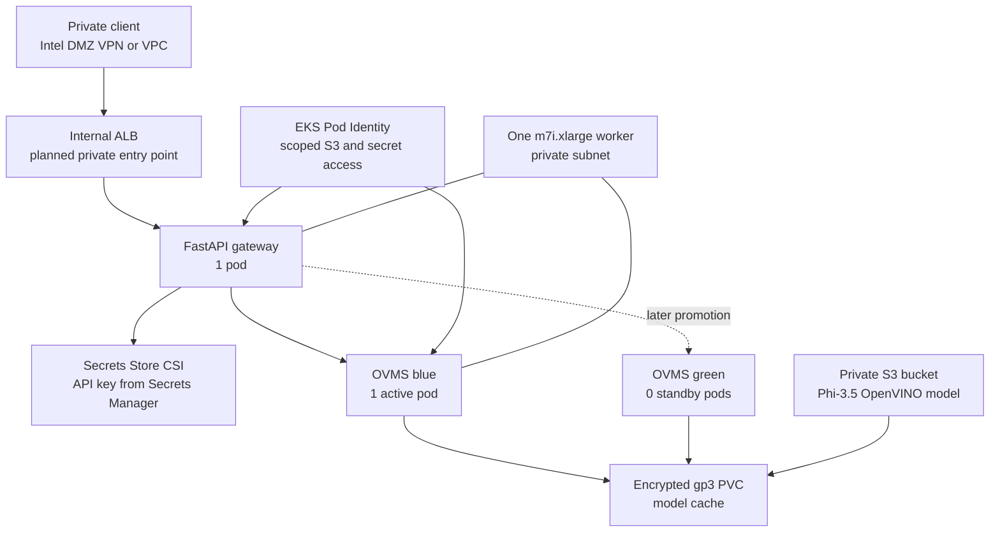

# AWS EKS OpenVINO LLM Inference POC

This repository serves an OpenVINO-optimized open-source LLM on Amazon EKS.
The current low-cost demo uses one Intel `m7i.xlarge` worker and keeps the
production shape visible without pretending that a single node is highly
available.

## Current Demo Profile

- Cluster: Amazon EKS `1.36` in two private subnets in `ap-south-1`.
- Worker: one `m7i.xlarge` managed node labelled `nodepool=m7i-inference`.
- Model: `OpenVINO/Phi-3.5-mini-instruct-int4-ov`.
- Inference: one active OVMS blue StatefulSet; green remains at zero replicas.
- Storage: encrypted `gp3` EBS cache provisioned by `ebs.csi.aws.com`.
- Model source: private S3 bucket, read through EKS Pod Identity.
- Gateway: one FastAPI pod; its image must still be pushed to private ECR.
- Secret: AWS Secrets Manager mounted through the AWS-managed Secrets Store CSI add-on.
- Bootstrap egress: a temporary NAT Gateway permits public image pulls.
- Target ingress: an internal AWS ALB, reachable only through the private network.

The live learning cluster currently has both private and public EKS API access
enabled. The application ALB remains internal. Disable public EKS API access
after a VPN, Direct Connect path, or VPC-hosted runner can reach the private API.

Strict scope: this AWS version demonstrates Intel CPU inference. It does not
claim Intel GPU or NPU validation.

## Architecture



## Request Flow

1. A private client sends an authenticated request to the internal ALB.
2. The ALB routes it to the gateway ClusterIP service.
3. The gateway checks the API key mounted from Secrets Manager.
4. The gateway forwards the request to the active OVMS blue service.
5. OVMS runs the Phi-3.5 INT4 model from its local EBS cache.
6. On first start, an init container copies the model from S3 into that cache.

## Repository Layout

| Path | Purpose |
| --- | --- |
| `k8s/aws` | EKS application, storage, secret-mount, scaling, and ingress manifests. |
| `gateway` | FastAPI gateway, container definition, and tests. |
| `scripts` | Smoke, benchmark, and recovery demonstration commands. |
| `terraform/aws` | Optional production-oriented infrastructure automation. |
| `docs/aws-eks-openvino-llm-poc.md` | Manual deployment runbook matching the current console-built cluster. |

## Deploy From The Current State

Use the detailed runbook:

[AWS EKS deployment runbook](docs/aws-eks-openvino-llm-poc.md)

The immediate sequence is:

1. Verify the node, CoreDNS, Metrics Server, EBS CSI, the AWS-managed Secrets Store CSI add-on, Pod Identity, and `gp3`.
2. Verify the Phi-3.5 model prefix in S3.
3. Verify the digest-pinned gateway image in ECR.
4. Create the gateway secret and its Pod Identity association.
5. Replace only the remaining deployment-specific placeholders.
6. Apply the manifests directly and wait for OVMS readiness.
7. Smoke-test through port-forwarding before adding the internal ALB.

## Remaining Placeholders

- `REPLACE_WITH_INTERNAL_ALB_SECURITY_GROUP_ID`
- `REPLACE_WITH_GIT_REPOSITORY_URL`

The Git repository placeholder is needed only when Argo CD is enabled. Do not
apply a manifest while a placeholder required by that manifest remains.

## Capacity And Reliability

OVMS requests 2 vCPU and 6 GiB and is limited to 3 vCPU and 12 GiB. The gateway
requests 250 millicores and 256 MiB. This fits one `m7i.xlarge`, but one worker,
one active OVMS replica, and one gateway replica provide no node-level high
availability. Add workers before raising replica counts or testing failover.

## Validation

```powershell
python -m pytest gateway/tests
git diff --check
```

Live validation requires access to the EKS API and is documented in the
runbook. Keep model artifacts under `models/` local-only; the directory is
ignored by Git.
