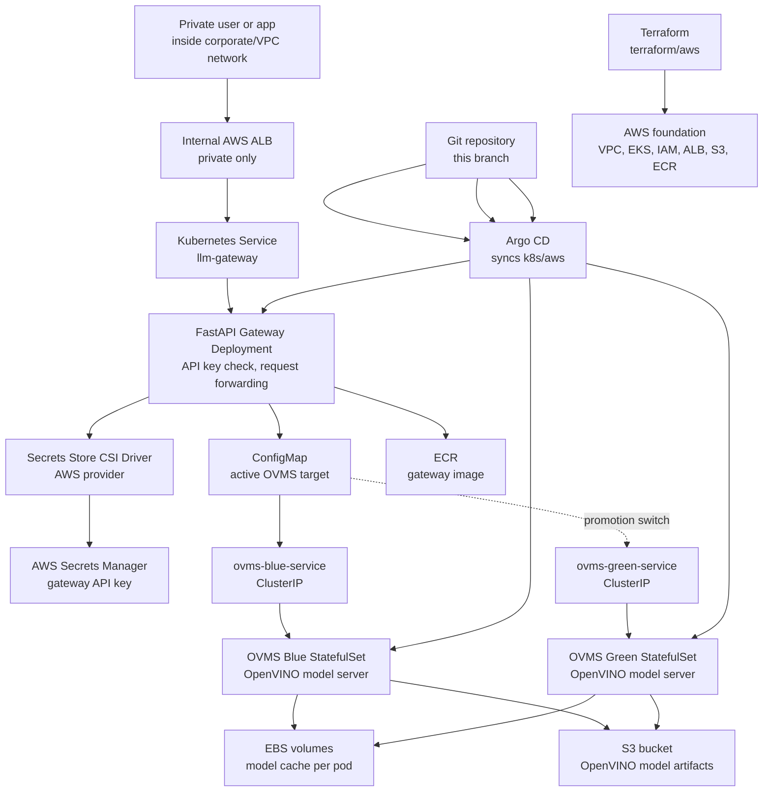

# AWS EKS OpenVINO LLM Inference POC

This repository contains a production-shaped proof of concept for serving an
OpenVINO LLM endpoint on Kubernetes using AWS EKS.

The current implementation is private-only and AWS-based.

## What This Builds

- A private EKS cluster running in private subnets.
- Intel M7i managed node groups for OpenVINO CPU inference.
- OpenVINO Model Server running blue and green StatefulSets.
- A FastAPI gateway in front of OVMS.
- An internal AWS ALB for private user access.
- AWS Secrets Manager integration through Secrets Store CSI Driver.
- S3 model storage with EBS-backed per-pod model caches.
- Argo CD GitOps sync for Kubernetes manifests.
- HPA and PodDisruptionBudget resources for a production-shaped deployment.
- Smoke, benchmark, and failure-demo scripts.

Strict scope note: this branch validates the AWS EKS architecture and Intel CPU
inference path. It does not claim Intel GPU or NPU validation.

## Architecture



## Repository Layout

| Path | Purpose |
| --- | --- |
| `terraform/aws` | AWS foundation: VPC, private EKS, node groups, IAM, ECR, S3, Secrets Manager, controllers, and outputs. |
| `k8s/aws` | Kubernetes application manifests synced by Argo CD. |
| `gateway/app/main.py` | FastAPI gateway that validates the API key and forwards chat requests to OVMS. |
| `gateway/Dockerfile` | Container build for the gateway image. |
| `scripts/aws-smoke-test.ps1` | Basic gateway health and chat smoke test. |
| `scripts/aws-benchmark.ps1` | Simple repeated-request benchmark. |
| `scripts/aws-failure-demo.sh` | Deletes one OVMS pod and waits for Kubernetes recovery. |
| `docs/aws-eks-openvino-llm-poc.md` | Full deployment runbook and operating notes. |

## Main Data Flow

1. A private client calls the internal ALB.
2. The ALB routes traffic to the gateway service.
3. The gateway validates the API key mounted from AWS Secrets Manager.
4. The gateway forwards chat requests to the active OVMS service.
5. OVMS serves the OpenVINO model from its local EBS cache.
6. Model artifacts are originally loaded from S3 into the pod cache.
7. Blue-green promotion is done by changing the gateway `OVMS_URL` ConfigMap.

## Deployment Flow

1. Create AWS infrastructure with Terraform from `terraform/aws`.
2. Build and push the gateway image to ECR.
3. Replace manifest placeholders in `k8s/aws`.
4. Add the gateway API key value to AWS Secrets Manager.
5. Upload approved OpenVINO model artifacts to S3.
6. Apply the Argo CD Application.
7. Run smoke and benchmark scripts from a network path that can reach the internal ALB.

The detailed command-by-command runbook is here:

[docs/aws-eks-openvino-llm-poc.md](docs/aws-eks-openvino-llm-poc.md)

## Important Placeholders

The manifests intentionally include placeholders until Terraform and image
builds produce real values:

- `REPLACE_WITH_GATEWAY_ECR_IMAGE`
- `REPLACE_WITH_GATEWAY_SERVICE_ACCOUNT_ROLE_ARN`
- `REPLACE_WITH_OVMS_MODEL_READER_SERVICE_ACCOUNT_ROLE_ARN`
- `REPLACE_WITH_MODEL_BUCKET_NAME`
- `REPLACE_WITH_INTERNAL_ALB_SECURITY_GROUP_ID`
- `REPLACE_WITH_GIT_REPOSITORY_URL`

Do not apply the manifests before replacing these values.

## Validation

Local validation currently covers:

- FastAPI gateway unit tests.
- YAML parse checks for Kubernetes manifests.
- PowerShell script parser checks.
- Git whitespace checks.

Live validation still requires a real AWS account and a reachable private EKS
cluster. Terraform, ALB provisioning, IRSA, CSI mounts, S3 model sync, EBS
volumes, HPA behavior, and OVMS readiness cannot be fully proven locally.

## Current Branch

The active development branch is:

```text
codex/aws-eks-openvino-poc
```

The branch has been pushed to:

[github.com/tusharkrbarman/k8s/tree/codex/aws-eks-openvino-poc](https://github.com/tusharkrbarman/k8s/tree/codex/aws-eks-openvino-poc)
