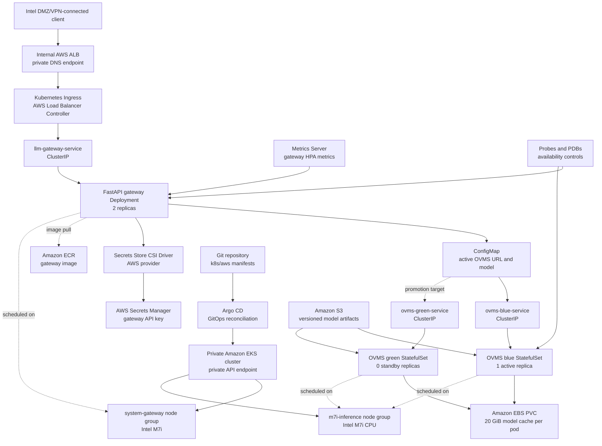

# OpenVINO on Kubernetes: DevOps Interview Handbook

## How To Use This Handbook

This handbook prepares you to explain the project as a DevOps and platform
engineering exercise. It covers the progression from a single Docker
container to local Kubernetes, a two-node k3s cluster, and a production-shaped
private Amazon Elastic Kubernetes Service (EKS) design.

Use it in three passes:

1. Learn the project summary and two-minute explanation.
2. Study the architecture, networking, identity, storage, and reliability
   sections.
3. Rehearse the troubleshooting cases, interview questions, and strict claim
   boundaries.

The current repository is the source of truth for the AWS design. Earlier
Docker, Minikube, and k3s experiments are recorded as project-history
validation because their old manifests are no longer kept on this branch.

## Interview-Ready Project Summary

### One-Sentence Summary

I designed a private Kubernetes platform for serving an open-source language
model through OpenVINO Model Server, starting with local validation and
evolving it into a production-shaped AWS EKS architecture with private
networking, workload identity, persistent model caching, health checks,
GitOps, and blue-green model rollout.

### Thirty-Second Pitch

The project serves an OpenVINO-optimized open-source language model behind a
small FastAPI gateway. I first validated OpenVINO Model Server in Docker, moved
it to Minikube, and then built a two-node k3s cluster on lightweight Ubuntu
VMs to learn scheduling, Services, storage, resource limits, and failure
diagnosis. The AWS implementation uses a private EKS cluster, internal
Application Load Balancer, private subnets, IAM roles for service accounts,
S3 model storage, EBS model caches, Secrets Manager, and Argo CD. Kubernetes
manages health, placement, restarts, gateway scaling, and blue-green model
deployment.

### Two-Minute Explanation

The system has two application layers. The FastAPI gateway is the policy and
API layer: it validates an `X-API-Key`, validates the request body, checks
whether OpenVINO Model Server is ready, forwards the request, and returns a
small stable response. OpenVINO Model Server, or OVMS, is the inference layer:
it loads an OpenVINO-optimized model and exposes an OpenAI-compatible chat
completion endpoint.

On AWS, private users enter through one internal Application Load Balancer
created from a Kubernetes Ingress. The load balancer sends traffic to the
gateway's ClusterIP Service, and the gateway forwards valid requests to the
active OVMS ClusterIP Service. Model artifacts are stored in S3. An init
container copies them into an EBS-backed persistent volume before OVMS starts.
The API key stays in AWS Secrets Manager and is mounted into the gateway pod by
the Secrets Store CSI Driver.

The cluster is private-only. Worker nodes run in private subnets, the EKS API
does not expose a public endpoint, and AWS service traffic can use VPC
endpoints. The Terraform implementation defines the VPC, EKS, node groups,
IAM, ECR, S3, Secrets Manager, controllers, and add-ons. Argo CD applies the
Kubernetes manifests. Blue is active with one OVMS replica; green is defined
but scaled to zero until a controlled promotion.

The strongest part of the project is the progression and troubleshooting. I
diagnosed invalid image tags, model initialization timing, memory pressure,
CPU instruction behavior under nested virtualization, empty Service
endpoints, and dynamic Minikube tunnel URLs by inspecting events, logs,
readiness, endpoint objects, and resource state rather than repeatedly changing
configuration.

### Resume-Ready Bullets

- Designed a private AWS EKS architecture for OpenVINO LLM inference using an
  internal ALB, private subnets, VPC endpoints, IAM roles for service accounts,
  S3 model storage, EBS caches, Secrets Manager, and Argo CD.
- Built and tested an inference path from Docker to Minikube and a two-node k3s
  VM cluster, diagnosing image, storage, memory, networking, and CPU
  compatibility failures.
- Implemented a FastAPI gateway with API-key authentication, input validation,
  separate liveness and readiness checks, OVMS request forwarding, and latency
  and token-usage logging.

### What The End User Does

The end user does not operate Kubernetes or OpenVINO. An internal application,
developer, or employee sends a prompt to the private gateway:

```text
POST /chat
X-API-Key: <approved key>

{
  "message": "Explain Kubernetes in simple terms",
  "max_tokens": 64
}
```

The user receives the generated answer, model name, latency, and token usage.
Kubernetes, OVMS, storage synchronization, health checks, and recovery remain
platform responsibilities.

## Problem And Engineering Goals

### Problem

Running a model in one container is enough for a demonstration, but it does not
answer platform questions:

- How is the model exposed safely?
- How are failed processes restarted?
- How are model files persisted and distributed?
- How are secrets kept outside images and YAML?
- How is traffic moved between model versions?
- How is the service deployed repeatedly?
- How can the design remain private inside a corporate network?

The project turns model inference into an operable service rather than a
single-machine experiment.

### Goals

- Serve an open-source model through a stable HTTP API.
- Use OpenVINO for optimized Intel CPU inference.
- Separate API policy from the inference server.
- Keep the EKS API and application endpoint private.
- Store model artifacts and secrets in managed AWS services.
- Use Kubernetes-native health, scheduling, storage, and disruption controls.
- Make infrastructure and application deployment reproducible.
- Preserve a path from a small POC to a larger production model.

### Non-Goals

- Training or fine-tuning a model.
- Building a consumer chat user interface.
- Claiming Intel GPU or NPU validation.
- Presenting gateway HPA as automatic inference scaling.
- Treating the POC as a completed multi-region production platform.

## Implementation Journey

### Stage 1: OVMS In Docker On Windows

The first goal was to prove the inference server independently of Kubernetes.
OpenVINO Model Server started in Docker and exposed its REST port on
`localhost:8000`.

At first, `GET /v1/config` returned:

```json
{}
```

That did not mean the HTTP server was broken. OVMS was still downloading and
initializing the model. The logs showed Git Large File Storage downloading a
multi-gigabyte `openvino_model.bin`. Calling the chat route too early produced
a MediaPipe graph-not-found error because the model graph was not ready.

The correct readiness evidence was:

```json
{
  "OpenVINO/Phi-3.5-mini-instruct-int4-ov": {
    "model_version_status": [
      {
        "version": "1",
        "state": "AVAILABLE",
        "status": {
          "error_code": "OK",
          "error_message": "OK"
        }
      }
    ]
  }
}
```

After the model became `AVAILABLE`, chat completion returned a valid response
with prompt, completion, and total token counts. This stage proved:

- The container image could run on the laptop CPU.
- OVMS could download and load an OpenVINO model.
- The REST configuration and chat endpoints worked.
- Readiness had to mean model availability, not merely an open TCP port.

### Stage 2: Minikube On The Laptop

The same serving workload was moved into Minikube to learn Kubernetes without
the cost and complexity of multiple machines.

The main resources were:

- A Deployment for OVMS.
- A Service for stable access.
- Resource requests and limits.
- Health probes against `/v1/config`.
- A local model cache.

Important lessons:

- An invalid image tag, `openvino/model_server:2025.4-py`, caused
  `ErrImagePull` and `ImagePullBackOff`. Kubernetes events showed that the
  image manifest did not exist.
- A running pod was not enough. The Service needed a ready endpoint before it
  could route traffic.
- With Minikube's Docker driver on Windows, `minikube service --url` created a
  temporary tunnel and returned a dynamic localhost port. The tunnel terminal
  had to stay open.
- Reusing an older tunnel URL caused connection failures even though the pod
  was healthy.

The successful local benchmark ran five requests:

| Run | Status | Latency | Completion tokens | Completion tokens/sec |
| --- | --- | ---: | ---: | ---: |
| 1 | OK | 5.023 s | 35 | 6.97 |
| 2 | OK | 1.826 s | 35 | 19.17 |
| 3 | OK | 1.817 s | 35 | 19.26 |
| 4 | OK | 1.848 s | 35 | 18.94 |
| 5 | OK | 1.832 s | 35 | 19.10 |
| **Average** |  | **2.469 s** |  | **16.69** |

These are local results, not AWS results. The slower first request indicates a
cold-start or runtime warm-up effect. Subsequent requests were consistently
around 1.8 seconds.

### Stage 3: Two-Node k3s Cluster On Ubuntu VMs

The next stage simulated separate bare-metal machines using two lightweight
Ubuntu Server VMs:

```text
k3s server/control-plane VM
            |
            | Kubernetes cluster network
            v
k3s worker VM -> OVMS pod
```

The VMs used private RFC 1918 addresses in the `192.168.88.0/24` range. SSH
access had to be installed and enabled before remote administration worked.
The worker joined the k3s server using the k3s token and server address.

The OVMS workload used:

- A node label to place inference on the worker.
- A PersistentVolumeClaim for the model cache.
- A NodePort Service exposing port `30080`.
- Startup and readiness probes.

The request path was:

```text
Client -> worker private IP:30080 -> NodePort Service
       -> ready OVMS pod:8000 -> OpenVINO model
```

This stage exposed hardware and capacity problems that Minikube hid:

- The larger model was killed by the Linux out-of-memory mechanism.
- Kubernetes removed the pod from Service endpoints while it was unready.
- Reducing a PersistentVolumeClaim request below its already-provisioned
  capacity was rejected; PVC storage requests cannot be shrunk that way.
- The smaller
  `OpenVINO/Phi-3-mini-FastDraft-50M-int8-ov` model reached `AVAILABLE`.
- Inference triggered a oneDNN BRGEMM initialization failure under the virtual
  CPU. Constraining oneDNN to the AVX2 instruction set made the virtualized CPU
  behavior explicit:

  ```text
  ONEDNN_MAX_CPU_ISA=AVX2
  DNNL_MAX_CPU_ISA=AVX2
  ```

The k3s experiment proved cluster creation, worker scheduling, NodePort
exposure, persistent storage, probes, and model availability. It also showed
that a benchmark is a capacity test: a service that is ready at idle may still
fail under generation load.

### Stage 4: Production-Shaped Private AWS EKS Design

The final design replaced the manually managed control plane with Amazon EKS
and mapped the lessons into managed AWS services:

| Earlier concern | AWS design response |
| --- | --- |
| VM-based control plane | Managed EKS control plane |
| Direct NodePort access | Internal ALB through Kubernetes Ingress |
| Local model download/cache | S3 source plus per-pod EBS cache |
| Plain environment secret | Secrets Manager plus Secrets Store CSI |
| Manual deployment | Terraform bootstrap plus Argo CD sync |
| One mixed node pool | Separate platform and inference node groups |
| Manual model replacement | Blue-green OVMS Services and StatefulSets |
| Ad hoc health checks | `/health`, `/ready`, startup, readiness, and liveness probes |

The repository defaults to `us-east-1`; the console-learning deployment used
`ap-south-1`. Region names change resource endpoints and pricing, but not the
architecture.

## Final AWS EKS Architecture



### Why This Is Production-Shaped

It includes common production platform boundaries:

- Private control-plane and application access.
- Separate compute pools for platform and inference workloads.
- Least-privilege workload identities.
- Managed artifact, secret, and block storage.
- Health-based traffic admission.
- Declarative infrastructure and application configuration.
- Horizontal scaling for the stateless API layer.
- Controlled model-version promotion.

It is still a POC because production readiness also requires sustained load
testing, explicit service-level objectives, complete telemetry, backup and
restore testing, certificate/TLS design, policy enforcement, image promotion,
and verified failure behavior in AWS.

## End-To-End System Flows

### User Request Flow

```text
1. Private client resolves the internal ALB DNS name.
2. Client sends POST /chat with X-API-Key.
3. ALB sends traffic to the Ingress target group.
4. Ingress routes to llm-gateway-service.
5. Service selects a ready gateway pod.
6. Gateway validates API key and request limits.
7. Gateway calls the active OVMS ClusterIP Service.
8. OVMS generates tokens using the OpenVINO CPU runtime.
9. Gateway returns answer, model, latency, and token usage.
```

The end user never addresses the OVMS Service directly.

### Model Loading Flow

```text
1. An approved OpenVINO model is uploaded to an S3 prefix.
2. Kubernetes creates the OVMS pod and its 20 GiB EBS-backed PVC.
3. The sync-model init container runs before the OVMS container.
4. The init container uses the ovms-model-reader service account.
5. IRSA grants only S3 ListBucket and GetObject permissions.
6. aws s3 sync copies artifacts into /models on the PVC.
7. OVMS starts only after synchronization succeeds.
8. The startup probe waits for /v1/config.
9. The readiness probe admits traffic after the model is available.
```

S3 is the durable artifact source. EBS avoids downloading and reconstructing
the model cache on every container restart.

### Secret Flow

```text
1. The API key value is stored in AWS Secrets Manager.
2. The llm-gateway service account assumes its IRSA role.
3. The AWS provider for Secrets Store CSI calls Secrets Manager.
4. The driver mounts the value as /mnt/secrets-store/api-key.
5. The gateway reads the file and strips surrounding whitespace.
6. /ready fails if the key cannot be read.
7. /chat compares X-API-Key to the configured value.
```

The configuration disables synchronization to a normal Kubernetes Secret, so
the value is mounted directly instead of being copied into etcd as an ordinary
Secret.

### Deployment And GitOps Flow

```text
Terraform -> VPC, EKS, node groups, IAM, storage, endpoints, add-ons
Docker build -> gateway image -> ECR
Git commit -> k8s/aws manifests -> Argo CD
Argo CD -> reconcile desired resources into EKS
```

Terraform owns the AWS foundation and bootstrap add-ons. Argo CD owns the
application manifests after bootstrap. This keeps infrastructure lifecycle
separate from application reconciliation.

### Health And Recovery Flow

```text
Container process failure -> kubelet restarts container
Pod failure -> Deployment or StatefulSet creates replacement
Failed readiness -> Service and ALB stop sending new traffic
Node failure -> controller reschedules movable workloads
Voluntary disruption -> PDB limits simultaneous unavailability
High gateway CPU -> HPA increases gateway replicas
```

An EBS `ReadWriteOnce` volume and Availability Zone binding can affect where a
stateful OVMS replacement can run. Recovery claims must therefore be validated
with actual EBS and node-failure testing.

## Component Deep Dives

### OpenVINO And OVMS

OpenVINO is Intel's inference optimization and runtime toolkit. It converts or
loads optimized model representations and executes them on supported Intel
hardware.

OpenVINO Model Server is the serving layer around that runtime. OVMS adds:

- A long-running server process.
- REST and gRPC serving interfaces.
- OpenAI-compatible generation routes for supported model graphs.
- Model lifecycle and readiness reporting.
- Continuous batching and cache management.
- A deployable container image.

OpenVINO is the execution engine; OVMS is the network service that hosts it.

OVMS and Ollama overlap as local model-serving tools, but their goals differ.
Ollama optimizes developer convenience and local model use. OVMS is suited to
OpenVINO-specific optimization, standard serving protocols, Kubernetes
deployment, and Intel-oriented inference platform work.

### FastAPI Gateway

[The gateway implementation](../gateway/app/main.py) provides the client-facing
application contract while keeping OVMS internal.

Responsibilities:

- Validate `message` length from 1 to 2,000 characters.
- Restrict `max_tokens` to 1 through 256.
- Authenticate `X-API-Key`.
- Read the key from an environment variable or mounted file.
- Transform the request into an OVMS chat completion payload.
- Translate OVMS failures into HTTP `502`.
- Record latency and token usage.
- Expose separate `/health` and `/ready` endpoints.

The gateway does not implement model inference, model storage, or Kubernetes
orchestration. This narrow scope keeps it replaceable.

### Health Endpoints

`GET /health` is a shallow liveness check:

```json
{"status": "ok"}
```

It answers whether the gateway process can serve HTTP. It deliberately does
not depend on OVMS, so a temporary model outage does not cause Kubernetes to
restart a healthy gateway process.

`GET /ready` is a dependency-aware readiness check. It verifies:

- The API key is available.
- The configured OVMS URL can be converted to `/v1/config`.
- OVMS returns a successful response within the readiness timeout.

The Kubernetes readiness probe and ALB health check both use `/ready`.

### Gateway Deployment And Service

[The gateway manifest](../k8s/aws/gateway.yaml) defines:

- Two initial replicas.
- Placement on `nodepool=system-gateway`.
- A mounted Secrets Store CSI volume.
- CPU request `250m` and memory request `256Mi`.
- CPU limit `1` and memory limit `1Gi`.
- `/ready` readiness and `/health` liveness probes.
- A ClusterIP Service on port `8080`.

The ClusterIP Service provides a stable in-cluster virtual IP and load
balances across ready gateway pod endpoints. It does not create an AWS load
balancer.

### OVMS StatefulSets

[Blue OVMS](../k8s/aws/ovms-blue.yaml) is active with one replica.
[Green OVMS](../k8s/aws/ovms-green.yaml) is standby with zero replicas.

Each template defines:

- The `ovms-model-reader` service account.
- Placement on `nodepool=m7i-inference` and
  `inference=openvino-cpu`.
- An S3 synchronization init container.
- OpenVINO Model Server targeting `CPU`.
- A `2` GiB cache setting.
- CPU request `4`, memory request `12Gi`.
- CPU limit `8`, memory limit `24Gi`.
- A `20Gi` `ReadWriteOnce` volume claim.
- Startup, readiness, and liveness probes on `/v1/config`.

StatefulSet is appropriate because each replica has stable storage identity.
It does not automatically make the model highly available; replicas, topology,
storage binding, and capacity still determine availability.

### Ingress And Internal ALB

[The Ingress](../k8s/aws/gateway-ingress.yaml) specifies:

```text
Ingress class: alb
Scheme: internal
Target type: ip
Listener: HTTP 80
Health check: /ready
```

The AWS Load Balancer Controller watches the Ingress and creates one internal
Application Load Balancer. IP target mode routes directly to pod IPs rather
than using NodePort as the ALB target.

Ingress is the desired routing object. The controller is the software that
translates it into AWS resources. Without the controller, the Ingress object
does not create an ALB by itself.

### S3 And EBS

S3 and EBS solve different storage problems:

| Storage | Purpose |
| --- | --- |
| S3 | Durable, versioned source of approved model artifacts |
| EBS | Low-latency, writable model cache attached to one OVMS pod |

Terraform enables S3 versioning, blocks public access, and enables AES-256
server-side encryption. The OVMS identity receives read-only permissions.

EBS is provisioned through the Amazon EBS CSI Driver. Because EBS volumes are
zonal and `ReadWriteOnce`, scheduling and recovery must respect volume
topology.

### ECR

Amazon Elastic Container Registry stores the custom FastAPI gateway image.
Terraform enables image scanning on push. Worker nodes pull the image using
their node role and private ECR endpoints.

For stronger production promotion, immutable tags or image digests should
replace the current mutable gateway tags. The OVMS image in the manifests is
already digest-pinned.

### Argo CD

Argo CD watches the Git repository and the `k8s/aws` path. Automated sync,
pruning, and self-healing make Git the desired-state source after bootstrap.

This provides:

- Auditable configuration changes.
- Repeatable application deployment.
- Drift correction.
- A natural blue-green promotion workflow through Git.

Argo CD does not create the EKS cluster; Terraform must bootstrap the cluster
and Argo CD first.

### Repository Map

| Path | Responsibility |
| --- | --- |
| [`terraform/aws`](../terraform/aws) | AWS foundation and bootstrap add-ons |
| [`k8s/aws`](../k8s/aws) | Kubernetes application desired state |
| [`gateway/app/main.py`](../gateway/app/main.py) | Gateway runtime |
| [`gateway/tests/test_gateway.py`](../gateway/tests/test_gateway.py) | Gateway behavior tests |
| [`scripts/aws-smoke-test.ps1`](../scripts/aws-smoke-test.ps1) | Basic health and chat validation |
| [`scripts/aws-benchmark.ps1`](../scripts/aws-benchmark.ps1) | Repeated request measurement |
| [`scripts/aws-failure-demo.sh`](../scripts/aws-failure-demo.sh) | OVMS pod replacement demonstration |
| [`docs/aws-eks-openvino-llm-poc.md`](aws-eks-openvino-llm-poc.md) | AWS deployment runbook |

## AWS Networking Deep Dive

### VPC And Availability Zones

The Terraform VPC uses:

- One `/16` VPC CIDR, defaulting to `10.80.0.0/16`.
- Two Availability Zones.
- Two private subnets.
- Two public subnets.
- DNS support and DNS hostnames.
- One NAT Gateway for the low-cost POC.

Worker nodes and the internal ALB use private subnets. Public subnets provide
the NAT Gateway path; they do not make private worker nodes publicly
addressable.

For corporate connectivity, the VPC CIDR must not overlap Intel DMZ, VPN, or
on-premises routes.

### Route Tables

A route table is associated with a subnet, not directly with a pod, instance,
or endpoint ENI. Every resource in the subnet uses the subnet's effective
route table.

Typical private-subnet routes are:

```text
10.80.0.0/16 -> local
0.0.0.0/0    -> NAT Gateway
S3 prefix    -> S3 gateway endpoint
```

The `local` route handles communication between private IP addresses inside
the VPC.

### Gateway VPC Endpoint

The S3 gateway endpoint:

- Adds an S3 service-prefix route to selected route tables.
- Does not create an endpoint ENI.
- Does not require a security group.
- Does not require selecting endpoint subnets.
- Has no endpoint hourly charge.

The OVMS init container can reach S3 without sending S3 traffic through the
NAT Gateway.

### Interface VPC Endpoints

The design creates interface endpoints for:

```text
ecr.api
ecr.dkr
secretsmanager
sts
logs
monitoring
```

An interface endpoint creates an Elastic Network Interface (ENI) with a
private IP in every selected subnet. Private DNS maps the normal regional AWS
service name to those private IPs.

```text
Pod -> private DNS -> endpoint ENI:443 -> AWS service
```

Because the ENI receives traffic, it needs a security group. The Terraform
endpoint security group permits TCP `443` from the VPC CIDR. Interface
endpoints do not need custom route-table entries; normal VPC local routing
reaches their private IPs.

Placing an endpoint in both private subnets provides an endpoint ENI in each
Availability Zone. That improves zonal resilience but incurs endpoint charges
for each service in each zone.

### NAT Versus VPC Endpoints

| NAT Gateway | VPC endpoint |
| --- | --- |
| General outbound path | Private path to a specific supported AWS service |
| Uses a public service endpoint | Uses AWS private networking |
| Hourly and data-processing cost | Interface endpoints have hourly/AZ and data cost |
| Supports external registries and package sites | Does not provide general internet access |
| One route can serve many destinations | One endpoint service per AWS API family |

The POC uses both. Endpoints privatize core AWS-service traffic, while NAT
supports bootstrap or destinations that do not have endpoints. A stricter
environment can mirror every required image into ECR and reduce NAT
dependence.

### Private EKS Endpoint

Terraform configures:

```text
cluster_endpoint_private_access = true
cluster_endpoint_public_access  = false
```

`kubectl`, Terraform's Kubernetes/Helm providers, and operational scripts must
run from a system that can route to the VPC, such as:

- An Intel DMZ VPN-connected laptop.
- A Direct Connect-connected network.
- A bastion or managed workstation inside the VPC.
- A private runner.
- An EKS Console CloudShell VPC environment.

The EKS API endpoint administers Kubernetes. The internal ALB serves
application requests. They are distinct endpoints with different security
boundaries.

### Subnet Tags

Private subnets use:

```text
kubernetes.io/role/internal-elb = 1
kubernetes.io/cluster/openvino-llm-poc = shared
```

The first tag tells the AWS Load Balancer Controller where internal load
balancers may be created. The cluster tag records intended sharing/ownership.

## IAM And Security Model

### Why Separate Roles

One broad IAM role would be easy to create but difficult to defend. The design
separates identities by responsibility:

| Identity | Trusted principal | Main purpose |
| --- | --- | --- |
| EKS cluster role | `eks.amazonaws.com` | Allow the managed control plane to manage required AWS resources |
| Node role | `ec2.amazonaws.com` | Allow kubelet/node bootstrap and ECR image pulls |
| EBS CSI role | EKS OIDC service account | Provision and attach EBS volumes |
| ALB controller role | `kube-system:aws-load-balancer-controller` | Manage ALB-related AWS resources |
| Gateway role | `llm-inference:llm-gateway` | Read one Secrets Manager secret |
| OVMS model-reader role | `llm-inference:ovms-model-reader` | List and read model objects from one S3 bucket |

Compromise of the gateway pod should not grant model-bucket administration or
load-balancer permissions. Compromise of an OVMS pod should not reveal the
gateway API key.

### IRSA

IAM Roles for Service Accounts (IRSA) connects:

```text
Kubernetes service account
        -> EKS OIDC identity token
        -> IAM role trust policy
        -> short-lived STS credentials
        -> permitted AWS API
```

The IAM trust policy limits which namespace and service account may assume the
role. The permission policy limits the AWS operations and resources.

IRSA is preferable to placing S3 and Secrets Manager permissions on the node
role. A node role is shared by every pod that can reach node metadata; a
workload role follows the specific pod identity.

### Secret Handling

The API key:

- Is not built into the image.
- Is not committed to Git.
- Is not embedded in a ConfigMap.
- Is not synchronized into a normal Kubernetes Secret by this configuration.
- Is mounted read-only into the gateway pod.

Production improvements would include secret rotation testing, TLS, stronger
client identity such as corporate OIDC or mutual TLS, and audited access
policies.

### Security Groups

Security groups are stateful firewalls:

- The internal ALB security group allows HTTP from trusted private CIDRs.
- The endpoint security group allows HTTPS from the VPC CIDR.
- EKS-managed cluster and node security groups protect control-plane and node
  communication.

For production, replace broad VPC-CIDR rules with approved corporate ranges or
source security groups where practical.

## Kubernetes Concepts Demonstrated

| Concept | Use in this project |
| --- | --- |
| Namespace | Isolates application resources in `llm-inference` |
| Pod | Smallest execution unit for gateway, OVMS, init containers, and add-ons |
| Deployment | Runs interchangeable stateless gateway replicas |
| StatefulSet | Gives OVMS replicas stable storage identity |
| ClusterIP Service | Provides stable internal discovery and balances across ready pods |
| Headless Service | Supplies StatefulSet network identity without a virtual ClusterIP |
| Ingress | Declares private HTTP routing to the gateway |
| Ingress controller | Translates Ingress into an AWS ALB |
| ConfigMap | Selects active OVMS URL and model name |
| ServiceAccount | Gives each workload a Kubernetes and AWS identity |
| SecretProviderClass | Defines which Secrets Manager object to mount |
| PersistentVolumeClaim | Requests a 20 GiB EBS model-cache volume |
| Init container | Synchronizes S3 model files before OVMS starts |
| Startup probe | Gives slow model initialization time to complete |
| Readiness probe | Removes unready pods from traffic |
| Liveness probe | Restarts a stuck process |
| Requests | Reserve schedulable CPU and memory |
| Limits | Cap container CPU/memory consumption |
| Labels | Identify workloads and select Services/pods |
| Node selector | Places gateway and inference workloads on separate node pools |
| HPA | Scales gateway replicas from CPU metrics |
| PDB | Limits voluntary concurrent disruption |
| Argo CD Application | Reconciles Git state into the cluster |

### NodePort Versus ClusterIP Versus LoadBalancer

- NodePort exposes the same fixed port on every node and was useful for the
  k3s POC.
- ClusterIP exposes a service only inside the cluster and is used between the
  gateway and OVMS.
- In the AWS design, the internal ALB is created from Ingress. The gateway
  Service remains ClusterIP.

NodePort does not provide a stable external entry address by itself. The
Service load-balances across ready pod endpoints, while an external or
internal load balancer provides one client-facing endpoint.

## Reliability, Scaling, And Deployment Strategy

### Probes

OVMS startup can take minutes because it may synchronize artifacts, initialize
the graph, allocate cache, and compile runtime operations. A startup probe
prevents liveness from killing it during legitimate initialization.

Readiness and liveness answer different questions:

```text
Liveness: should Kubernetes restart this process?
Readiness: should this pod receive new traffic?
```

The gateway liveness check is shallow. Its readiness check includes the API
key and OVMS dependency. That prevents restart loops during a downstream
outage while still removing the gateway from traffic.

### Resource Management

The OVMS pod requests 4 CPU and 12 GiB memory and limits at 8 CPU and 24 GiB.
The request determines scheduling. A nominal 4-vCPU node is usually too small
because Kubernetes reserves some CPU for the operating system and node
services. The Terraform inference type `m7i.2xlarge` provides room for the
request and platform overhead.

Resource sizing must include:

- Model weights and runtime graph.
- KV cache.
- Request concurrency.
- Temporary initialization memory.
- Kubernetes and operating-system reservation.
- Desired headroom for failure and rolling operations.

### Gateway HPA

[The HPA](../k8s/aws/hpa.yaml) targets the gateway Deployment:

```text
Minimum replicas: 2
Maximum replicas: 4
CPU target: 70 percent average utilization
```

Metrics Server supplies resource metrics. This scales the stateless API layer,
not OVMS. Inference autoscaling needs model-aware capacity, startup time, queue
depth, concurrency, and cost controls; it is intentionally not presented as
implemented here.

### PodDisruptionBudgets

[The PDB definitions](../k8s/aws/pdb.yaml) require at least one gateway and
active blue OVMS pod to remain available during voluntary disruptions such as
node draining.

A PDB does not protect against:

- Process crashes.
- Node power loss.
- Availability Zone failure.
- Insufficient replacement capacity.

It constrains voluntary eviction, not every failure mode.

### Blue-Green Model Promotion

Default state:

```text
Blue StatefulSet:  1 replica, active target
Green StatefulSet: 0 replicas, standby definition
```

Promotion sequence:

1. Update green to the candidate model configuration.
2. Scale green to one replica.
3. Wait for model synchronization and readiness.
4. Run direct or controlled validation.
5. Change the gateway `OVMS_URL` ConfigMap from blue Service to green Service.
6. Reconcile through Git/Argo CD.
7. Restart gateway pods because the ConfigMap is consumed as an environment
   variable.
8. Run smoke and benchmark checks.
9. Scale blue down after the rollback window.

This minimizes simultaneous inference cost while retaining an explicit
rollback target.

## Troubleshooting Case Studies

### Case 1: OVMS Returned An Empty Configuration

**Symptom**

`GET /v1/config` returned `{}`, and chat returned a graph-not-found error.

**Evidence**

OVMS logs showed the server listening but Git LFS was still downloading and
checking out model artifacts.

**Root cause**

The process was alive, but the model graph was not yet initialized.

**Correction**

Wait for `/v1/config` to report the model as `AVAILABLE`. Use model readiness,
not an open port, as the traffic gate.

**Lesson**

Health is layered: process health, application readiness, and model readiness
are not the same state.

### Case 2: `ImagePullBackOff`

**Symptom**

The Minikube pod cycled between `ErrImagePull` and `ImagePullBackOff`.

**Evidence**

`kubectl describe pod` reported:

```text
manifest for openvino/model_server:2025.4-py not found
```

**Root cause**

The requested image tag did not exist in the registry.

**Correction**

Use a verified image reference. The AWS manifests later improved this by
pinning OVMS to an image digest.

**Lesson**

Read the event message before changing credentials, DNS, or Kubernetes
configuration. The registry answered successfully and stated the exact
problem.

### Case 3: Service Had No Endpoints

**Symptom**

The NodePort Service existed, but the client could not connect and the
Endpoints object was empty.

**Evidence**

The OVMS pod was in `CrashLoopBackOff` or not ready.

**Root cause**

Services route only to selected ready pod endpoints. Creating a Service does
not make an unhealthy backend reachable.

**Correction**

Debug the pod state and readiness first, then verify EndpointSlice membership.

**Lesson**

Trace traffic in order:

```text
client -> load balancer/NodePort -> Service -> EndpointSlice -> pod -> process
```

### Case 4: Model Pod Was `OOMKilled`

**Symptom**

The pod started, consumed memory during model initialization, and was killed.

**Evidence**

`kubectl describe pod` showed `Last State: Terminated`, `Reason: OOMKilled`.

**Root cause**

The model, runtime, cache, and initialization peak exceeded the VM/container
memory available.

**Correction**

Use a smaller model for the constrained VM proof of concept and size requests,
limits, and node memory from measured peak usage.

**Lesson**

Quantization reduces model memory but does not remove runtime, cache, and
temporary allocation requirements.

### Case 5: BRGEMM CPU Compatibility Failure

**Symptom**

The smaller model became available, but generation crashed with an invalid
BRGEMM parameter error from the Intel CPU plugin.

**Evidence**

The stack trace identified `PagedAttentionExtension`, the CPU plugin, and a
oneDNN BRGEMM kernel initialization failure. The issue appeared when an actual
generation request exercised the kernel.

**Root cause**

The virtual CPU exposed an instruction/capability combination that the runtime
path did not handle reliably under nested virtualization.

**Correction**

Constrain oneDNN to AVX2 for the VM experiment and validate the workload on the
intended physical or cloud CPU before claiming performance.

**Lesson**

Readiness proves initialization, not every inference execution path. A smoke
request and benchmark are necessary after readiness.

### Case 6: Minikube URL Changed

**Symptom**

The benchmark could not connect even though the pod was healthy.

**Evidence**

`minikube service --url` returned a new localhost port, while the benchmark
still used an older port.

**Root cause**

The Docker-driver tunnel is temporary and bound to the terminal that created
it.

**Correction**

Keep the tunnel terminal open and pass its current URL to the benchmark.

**Lesson**

Separate backend health from client-path health. Dynamic local tunnels are not
stable production endpoints.

### Debugging Method Used

The repeatable investigation order was:

1. `kubectl get pods -o wide` for state and placement.
2. `kubectl describe pod` for events, termination reason, probes, and
   scheduling.
3. `kubectl logs` and `kubectl logs --previous` for current and crashed
   containers.
4. Service and EndpointSlice inspection for routing eligibility.
5. Node capacity, requests, limits, and PVC state.
6. A single smoke request before a repeated benchmark.

This prevents random edits across image, network, storage, and application
layers.

## Validation And Current Scope

| Capability | Local Docker | Minikube | k3s VMs | Repository implementation | Requires live AWS validation |
| --- | :---: | :---: | :---: | :---: | :---: |
| OVMS model availability | Yes | Yes | Yes | Yes | Yes |
| Chat completion | Yes | Yes | Yes, constrained | Yes | Yes |
| Local benchmark behavior | Yes | Yes | Partially stress-tested | Scripts exist | Yes |
| Kubernetes scheduling | No | Yes | Yes | Manifests exist | Yes |
| NodePort access | No | Local tunnel | Yes | Not used in AWS design | No |
| Internal ALB | No | No | No | Terraform/Ingress exist | Yes |
| S3 model sync | No | No | No | Init container/IAM exist | Yes |
| EBS model cache | No | Local storage | PVC tested locally | CSI/PVC definitions exist | Yes |
| Secrets Manager CSI mount | No | No | No | Terraform/manifests exist | Yes |
| IRSA | No | No | No | Roles and service accounts exist | Yes |
| Argo CD reconciliation | No | No | No | Helm/Application definitions exist | Yes |
| Gateway HPA | No | No | No | HPA/Metrics Server definitions exist | Yes |
| Blue-green promotion | No | No | No | Blue/green definitions exist | Yes |
| Intel GPU or NPU path | No | No | No | Not in current AWS scope | Outside current scope |

The table is the interview truth boundary. "Implemented" means the repository
contains the required code and declarative resources; it does not substitute
for live environment validation.

## Interview Questions And Answers

Use the first paragraph of each answer for a short response. Use the remaining
detail only when the interviewer asks a follow-up.

### What Is The Main DevOps Value?

The value is not merely running a model. It is turning model inference into a
private, deployable, observable, recoverable service with controlled identity,
storage, routing, and rollout behavior.

### Why Use Kubernetes?

Kubernetes provides a consistent control plane for scheduling, networking,
health checks, resource allocation, configuration, storage, recovery, and
rollouts. Those capabilities matter when a model server must become a shared
service rather than a process started manually on one machine.

In this project, Kubernetes:

- Schedules gateway and inference workloads onto separate node groups.
- Restarts failed containers and removes unready pods from Service endpoints.
- Gives the gateway and OVMS stable internal DNS names through Services.
- Mounts model-cache storage and the gateway API key declaratively.
- Supports gateway scaling, disruption protection, and blue-green promotion.

Kubernetes does not make an oversized model fit into memory, fix incompatible
CPU instructions, or determine safe inference concurrency automatically.
Those remain application and capacity-engineering responsibilities.

### Why Use OpenVINO Instead Of Ollama?

OpenVINO is an inference optimization runtime, while Ollama is primarily a
developer-friendly model runner and local model-management experience. This
project focuses on Intel CPU optimization, explicit model-serving
infrastructure, Kubernetes scheduling, and production-shaped APIs, so
OpenVINO is the more relevant foundation.

The strict comparison is not "OpenVINO is always better." Ollama is convenient
for quickly running models on a workstation. OpenVINO is useful when the
engineering objective is to optimize and serve models on Intel hardware with
control over the runtime and deployment architecture.

### Why Use OpenVINO Model Server?

OpenVINO Model Server (OVMS) packages OpenVINO inference behind network APIs
and adds serving behavior such as model lifecycle management and continuous
batching. It lets application clients call an HTTP endpoint instead of loading
the model runtime inside every application.

That separation gives the platform a clear boundary: OVMS owns model execution;
the gateway owns authentication and request policy; Kubernetes owns placement,
health, storage, and recovery.

### Why Put A Gateway In Front Of OVMS?

OVMS should not be the direct trust boundary for end users. The FastAPI gateway
provides API-key validation, a stable application endpoint, readiness checks,
request forwarding, and a single place for future rate limiting, audit
metadata, or corporate identity integration.

It also decouples clients from blue and green backends. Changing the
`OVMS_URL` configuration can promote another model-server Service without
changing the client-facing URL.

### Why Is OVMS A StatefulSet?

The model server uses per-pod persistent model-cache storage. A StatefulSet
provides stable pod identity and a predictable relationship between each pod
and its PersistentVolumeClaim (PVC), which is useful for expensive model
downloads and local cache reuse.

A Deployment could be sufficient if models were small, downloaded on every
start, or stored on a shared read-only filesystem. Here the StatefulSet makes
the storage lifecycle explicit.

### Why Use ClusterIP Services Internally?

ClusterIP exposes a stable virtual IP and DNS name only inside the cluster.
That is appropriate for the gateway and OVMS because neither component should
be opened directly through a public node port.

The internal Application Load Balancer (ALB) reaches the gateway pods through
the Ingress configuration, and the gateway reaches OVMS through its ClusterIP
Service. This keeps the model server off the external request boundary.

### Why Use Ingress And An Internal ALB?

Ingress expresses HTTP routing in Kubernetes, while the AWS Load Balancer
Controller translates that resource into an AWS ALB. The ALB is internal, so
it receives private addresses and is reachable only through approved private
network paths such as the Intel DMZ/VPN-connected environment.

This is one application load balancer for the POC. The EKS API endpoint is a
separate private control-plane endpoint and is not an application load
balancer.

### Why Use Both S3 And EBS?

Amazon S3 is the durable source of truth for versioned model artifacts.
Amazon Elastic Block Store (EBS) is the pod's local persistent cache. The OVMS
init container copies the selected model from S3 to the EBS-backed volume
before the server starts.

This separates durable artifact distribution from runtime access. S3 is
durable and centrally managed; EBS gives the pod filesystem semantics and
local block access expected by the model server. The trade-off is that an EBS
volume is Availability Zone-specific and is not a multi-writer shared model
store.

### Why Use Gateway And Interface VPC Endpoints?

Both endpoint types keep supported AWS-service traffic on private AWS
networking, but they work differently.

- The S3 gateway endpoint adds S3 routes to selected subnet route tables. It
  does not create endpoint network interfaces and has no endpoint security
  group.
- Interface endpoints create elastic network interfaces (ENIs) with private
  IP addresses in the selected subnets. Private DNS maps normal AWS service
  names to those addresses, and a security group controls HTTPS access.

The interface endpoints cover services such as ECR API, ECR Docker registry,
Secrets Manager, Security Token Service (STS), CloudWatch Logs, and
CloudWatch monitoring. NAT remains available for bootstrap traffic or
destinations that do not have an endpoint in this design.

### Why Place Interface Endpoints In Two Private Subnets?

Creating an endpoint ENI in each Availability Zone gives workloads a
same-zone private path and avoids making one zone's endpoint a single point of
dependency. Each endpoint ENI uses a private IP and incurs AWS PrivateLink
cost, so the availability benefit has a cost trade-off.

Interface endpoints use security groups because they accept network
connections. They do not need a special route-table entry: private DNS
resolves the service name to their private IP addresses, and the subnet's
normal local VPC route reaches those addresses.

### Why Use Separate IAM Roles?

Separate Identity and Access Management (IAM) roles reduce blast radius and
make the trust boundary reviewable.

- The EKS cluster role lets the managed control plane operate required AWS
  resources.
- The node role lets kubelet and node-level components join and operate.
- Controller roles give the ALB and EBS CSI controllers only the AWS
  permissions they need.
- Workload roles use IAM Roles for Service Accounts (IRSA): OVMS can read the
  model prefix in S3, while the gateway can read only its Secrets Manager
  secret.

Node access is therefore not treated as permission for every workload on that
node.

### How Does Kubernetes Recover From Failure?

The Deployment or StatefulSet controller replaces a failed pod. Startup and
readiness probes prevent traffic from reaching a pod before it is usable, and
a liveness probe can restart a stuck container. Services route only to ready
endpoints.

Recovery is still bounded by capacity and storage. A replacement cannot start
if no node has enough CPU or memory, and an EBS volume must be attachable in
the target Availability Zone. A PodDisruptionBudget (PDB) limits voluntary
disruptions; it does not protect against every node, zone, or application
failure.

### What Does The HPA Scale?

The Horizontal Pod Autoscaler (HPA) scales gateway replicas from two to four
based on CPU utilization reported by Metrics Server. It does not scale OVMS.

Inference scaling needs model-aware signals such as queue depth, concurrent
requests, token throughput, latency, and memory or key-value cache pressure.
CPU alone can be a poor signal for model-serving capacity, so OVMS scaling is
left as an explicit production next step.

### How Does Blue-Green Promotion Work?

The blue StatefulSet starts as the active one-replica backend and green starts
at zero. A release operator scales green up, waits until its OVMS configuration
reports the model as available, runs direct smoke tests, changes the gateway's
active OVMS Service target, and then verifies the client path.

Rollback changes the gateway target back to blue. Only after a stable
observation period should the old backend be scaled down. The repository
contains the blue and green resources, but the promotion still requires live
operational validation and disciplined sequencing.

### How Would This Move To Intel GPU Hardware?

First create or reserve a GPU-capable node group and expose the Intel GPU
devices to Kubernetes using the supported Intel device plugin and host driver
stack. Label and taint those nodes, update OVMS scheduling and resource
requests to claim the GPU resource, select the GPU target device, and validate
the model format and runtime version on that hardware.

Then repeat functional, concurrency, memory, failover, and performance tests.
Changing `--target_device` alone is not enough; drivers, device discovery,
container permissions, scheduling, and model compatibility must all be
verified.

### What Are The Main Production Gaps?

The main gaps are live AWS validation, measured capacity, transport and user
identity security, deeper observability, model-aware scaling, failure testing,
and automated promotion controls.

Specifically, the ALB, IRSA sessions, Secrets Store CSI mount, S3 model sync,
EBS attachment behavior, Argo CD reconciliation, HPA response, node drains,
Availability Zone failure, and AWS performance require live environment
testing. Transport Layer Security (TLS), corporate authentication, rate
limits, audit logs, NetworkPolicies, immutable model promotion, dashboards,
alerts, and backup/restore exercises should be completed before a production
launch.

### What Was The Hardest Technical Lesson?

A Kubernetes object being present does not mean the request path works.
Troubleshooting had to trace image availability, pod state, model readiness,
Service endpoints, client routing, resource capacity, and CPU execution in
order.

## STAR Stories

### Story 1: Diagnosing An Image Pull Failure

**Situation:** The Minikube OVMS pod stayed in `ImagePullBackOff`, so the model
service never started.

**Task:** Restore the deployment without changing unrelated Kubernetes
resources.

**Action:** I inspected the pod events with `kubectl describe pod`. The event
showed that `openvino/model_server:2025.4-py` had no registry manifest. I
replaced the invalid tag with an available OVMS image and watched the rollout,
pod logs, and `/v1/config` rather than assuming a running container meant the
model was ready. In the AWS design I then used a digest-pinned OVMS image to
remove tag ambiguity.

**Result:** The image pulled, OVMS initialized, and the model eventually
reported `AVAILABLE`. The lasting lesson was to read scheduler and kubelet
events first and to use immutable image references for controlled
environments.

### Story 2: Separating Memory And CPU Compatibility Failures

**Situation:** On the two-node k3s VM cluster, the original model pod was
`OOMKilled`. After moving to a smaller model, inference still crashed with a
PagedAttention/BRGEMM error under nested virtualization.

**Task:** Determine whether Kubernetes networking, memory, or CPU execution was
responsible and get a stable small-model path.

**Action:** I used pod termination reasons and resource limits to identify the
memory failure, then selected the smaller
`Phi-3-mini-FastDraft-50M-int8-ov` model. When the model became `AVAILABLE` but
the request still crashed, I read the OVMS logs and separated readiness from
inference execution. The BRGEMM stack trace pointed to CPU instruction
compatibility, so I constrained oneDNN to AVX2 with
`ONEDNN_MAX_CPU_ISA=AVX2` and `DNNL_MAX_CPU_ISA=AVX2`. I resumed with a smoke
request before applying benchmark load.

**Result:** The pod reached ready state with zero restarts and the endpoint
became reachable. Repeated load could still destabilize the constrained VM,
which produced the stronger capacity lesson: health checks prove service
eligibility, not safe throughput.

### Story 3: Evolving A Local Demo Into A Private Platform Design

**Situation:** Docker and Minikube proved that OVMS could serve a model, but
they did not address private enterprise access, least-privilege identity,
durable model distribution, controlled rollout, or multi-node operations.

**Task:** Design a production-shaped POC that could be operated from an Intel
DMZ/VPN-connected environment without exposing the application or EKS API
publicly.

**Action:** I separated platform and inference node groups, placed them in two
private subnets, selected an internal ALB, and retained NAT only for bootstrap
or uncovered destinations. I added an S3 gateway endpoint and interface
endpoints for core AWS APIs, with private DNS and endpoint security groups. I
used IRSA to separate S3 and Secrets Manager permissions, Secrets Store CSI to
mount the gateway key as a file, EBS for per-pod model cache, and Argo CD plus
blue-green manifests for controlled deployment.

**Result:** The repository now contains a coherent private EKS implementation
that can be deployed and validated stage by stage. I present the result
accurately: the architecture and automation exist, while AWS integration,
failure, scaling, and performance behavior remain live-validation work.

## Trade-Offs And Production Next Steps

The architecture deliberately favors clarity and managed services over the
smallest possible AWS bill. PrivateLink endpoints, EKS, NAT, ALB, and multiple
node groups all carry fixed costs. A learning deployment can temporarily use
one node per group, while the production-shaped Terraform defaults preserve
two nodes in each group.

Production work should prioritize:

1. Measured capacity and concurrency tests on the selected CPU.
2. TLS and corporate identity integration.
3. Full metrics, logs, traces, dashboards, and alerts.
4. Image and model promotion with immutable identifiers.
5. NetworkPolicy and admission-policy enforcement.
6. Backup, restore, node-drain, and Availability Zone failure tests.
7. Model-aware inference scaling or queue-based load shedding.
8. Multi-AZ storage and rollout behavior validation.
9. Cost budgets, ownership tags, and automated teardown for POC environments.

## Strict Claim Boundaries

Say:

- "I validated OVMS serving locally, then moved it through Minikube and k3s."
- "I implemented the private AWS EKS architecture and deployment definitions."
- "The AWS path uses Intel M7i CPU instances and OpenVINO CPU inference."
- "The local benchmark averaged 2.469 seconds and 16.69 completion tokens per
  second."
- "Gateway autoscaling is defined; model-server autoscaling is a separate
  production concern."

Do not say:

- "This is already a production deployment."
- "The local benchmark represents AWS or bare-metal performance."
- "The project validated Intel GPU or NPU inference."
- "A PodDisruptionBudget guarantees availability."
- "NodePort is a production load balancer."
- "Kubernetes automatically solves model capacity and KV-cache sizing."
- "Blue-green deployment is complete merely because two YAML files exist."

## Final Revision Checklist

- Can I explain the end-user request path without mentioning implementation
  details first?
- Can I distinguish OpenVINO from OVMS and Ollama?
- Can I explain why the gateway exists?
- Can I trace traffic from ALB to pod?
- Can I explain why a Service can have no endpoints?
- Can I compare ClusterIP, NodePort, Ingress, and an ALB?
- Can I explain route tables, NAT, gateway endpoints, and interface endpoints?
- Can I explain why interface endpoints need security groups but no special
  route-table entry?
- Can I explain cluster, node, controller, and workload IAM roles separately?
- Can I explain IRSA without saying credentials are stored in the pod?
- Can I explain why S3 and EBS are both used?
- Can I explain startup, readiness, and liveness probes?
- Can I explain why gateway HPA does not scale inference?
- Can I explain the blue-green promotion and rollback sequence?
- Can I describe the benchmark environment accurately?
- Can I state what still needs live AWS validation?
